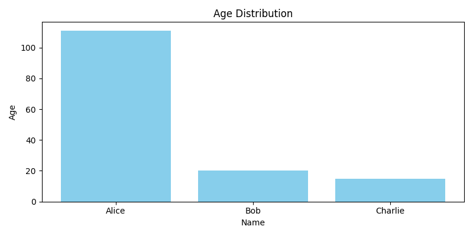

# DataFrame Table
| Name    |   Age | City        |
|:--------|------:|:------------|
| Alice   |   111 | New York    |
| Bob     |    20 | Los Angeles |
| Charlie |    15 | Chicago     |

# Graph

